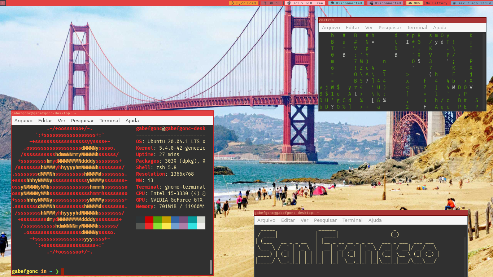

# San Francisco Rice: dotfiles

## Installation:
Just install the softwares in SOFTWARE_LIST.txt,
rename all the files and folders that start with "dot_" with ".file_name" and then copy these files to your home directory.

## Why did i made a San Francisco desktop?
I always liked this city a lot, even though I don't live there. The titlebar colors are the colors of the Golden Gate Bridge, same for the topbar. The i3status colors are the colors of the houses near Alamo Square. Sorry if i'm wrong, again, i don't live in San Francisco. (wish i could hahaha)